= 👋 Hi, there
:stylesdir: src/css
:stylesheet: style.css

image::https://readme-typing-svg.demolab.com?font=Fira+Code&weight=700&size=48&duration=3000&pause=1000&center=true&vCenter=true&width=1024&height=128&lines=%F0%9F%91%8B+Hi%2C+I'm+Andr%C3%A9+Augusto+%F0%9F%A4%93;%F0%9F%8F%A0+I'm+a+developer+from+Brazil+%F0%9F%8C%8E;%F0%9F%A7%91%E2%80%8D%F0%9F%92%BB+I+%E2%9D%A4%EF%B8%8F+open+source+%E2%9D%A4%EF%B8%8F[Typing SVG]

'''
[%collapsible]
[role="h2"]
.**🛠️ Technologies & Tools**
====
[role="h3"]
*⌨️ Programming languages*

[role="rounded-img bg-common"]
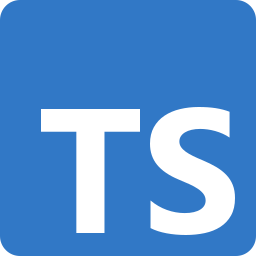
image:assets/icons/javascript.svg[JavaScript, link="https://developer.mozilla.org/docs/Web/JavaScript", title="JavaScript", width=48]
image:assets/icons/html5.svg[HTML5, link="https://html.spec.whatwg.org/multipage/", title="HTML5", width=48]
image:assets/icons/css3.svg[CSS3, link="https://w3.org/Style/CSS", title="CSS3", width=48]

[role="rounded-img bg-common"]
image:assets/icons/java.svg[Java, link="https://java.com", title="Java", width=48]
image:assets/icons/kotlin.svg[Kotlin, link="https://kotlinlang.org/", title="Kotlin", width=48]
[role="rounded-img bg-common"]
image:assets/icons/dart.svg[Dart, link="https://dart.dev/", title="Dart", width=48]
image:assets/icons/csharp.svg[C#, link="https://learn.microsoft.com/dotnet/csharp", title="C#", width=48]
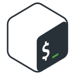
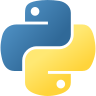

[role="h3"]
*⚙️ Frameworks*

[role="rounded-img bg-common"]
image:assets/icons/react.svg[React, link="https://react.dev/", title="React", width=48]
image:assets/icons/nextjs.svg[Next.js, link="https://nextjs.org/", title="Next.js", width=48]
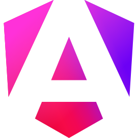
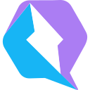

[role="rounded-img bg-common"]
image:assets/icons/nodejs.svg[Node.js, link="https://nodejs.org/", title="Node.js", width=48]
image:assets/icons/flutter.svg[Flutter, link="https://flutter.dev/", title="Flutter", width=48]

[role="rounded-img bg-common"]
image:assets/icons/tailwindcss.svg[TailwindCSS, link="https://tailwindcss.com", title="TailwindCSS", width=48]

[role="h3"]
*💽 Databases*

[role="rounded-img bg-common"]
image:assets/icons/mongodb.svg[MongoDB, link="https://mongodb.com", title="MongoDB", width=48]
image:assets/icons/supabase.svg[Supabase, link="https://supabase.com", title="Supabase", width=48]

[role="h3"]
*🧰 Tools*

[role="rounded-img bg-common"]
image:assets/icons/git.svg[Git, link="https://git-scm.com", title="Git", width=48]
image:assets/icons/github.svg[GitHub, link="https://github.com", title="GitHub", width=48]

[role="rounded-img bg-common"]
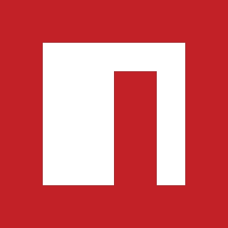
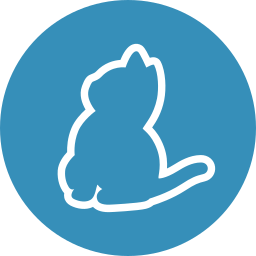
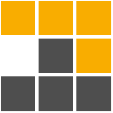
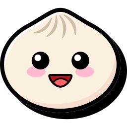

[role="rounded-img bg-common"]
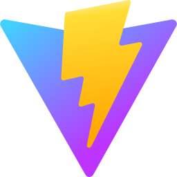
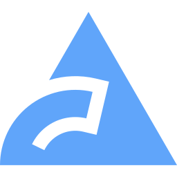

[role="h3"]
*💾 Softwares*

[role="rounded-img bg-common"]
image:assets/icons/windows11.svg[Windows, link="https://microsoft.com/windows", title="Windows", width=48]
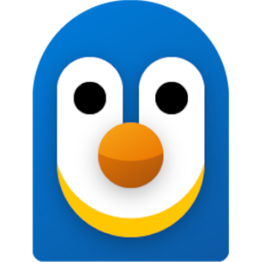
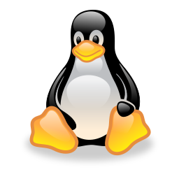
image:assets/icons/archlinux.svg[ArchLinux, link="https://archlinux.org", title="ArchLinux", width=48]
image:assets/icons/nixos.svg[Nix, link="https://nixos.org", title="Nix", width=48]

[role="rounded-img bg-common"]
image:assets/icons/vscode.svg[VS Code, link="https://code.visualstudio.com/", title="VS Code", width=48]
image:assets/icons/intellij.svg[IDEA, link="https://jetbrains.com/idea", title="IDEA", width=48]

[role="rounded-img bg-common"]

image:assets/icons/vivaldi.svg[Vivaldi, link="https://vivaldi.com/", title="Vivaldi", width=48]

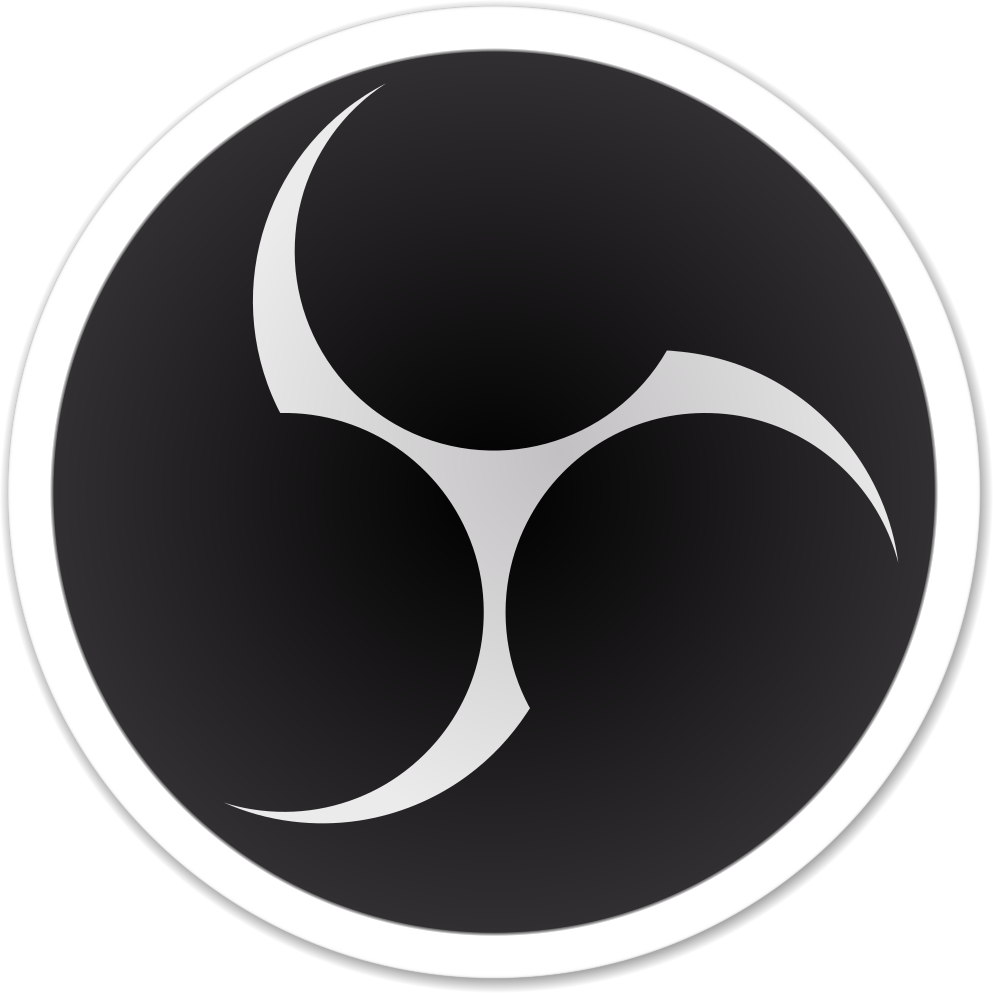

[role="rounded-img bg-common"]
image:assets/icons/gimp.svg[GIMP, link="https://gimp.org/", title="GIMP", width=48]
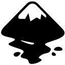
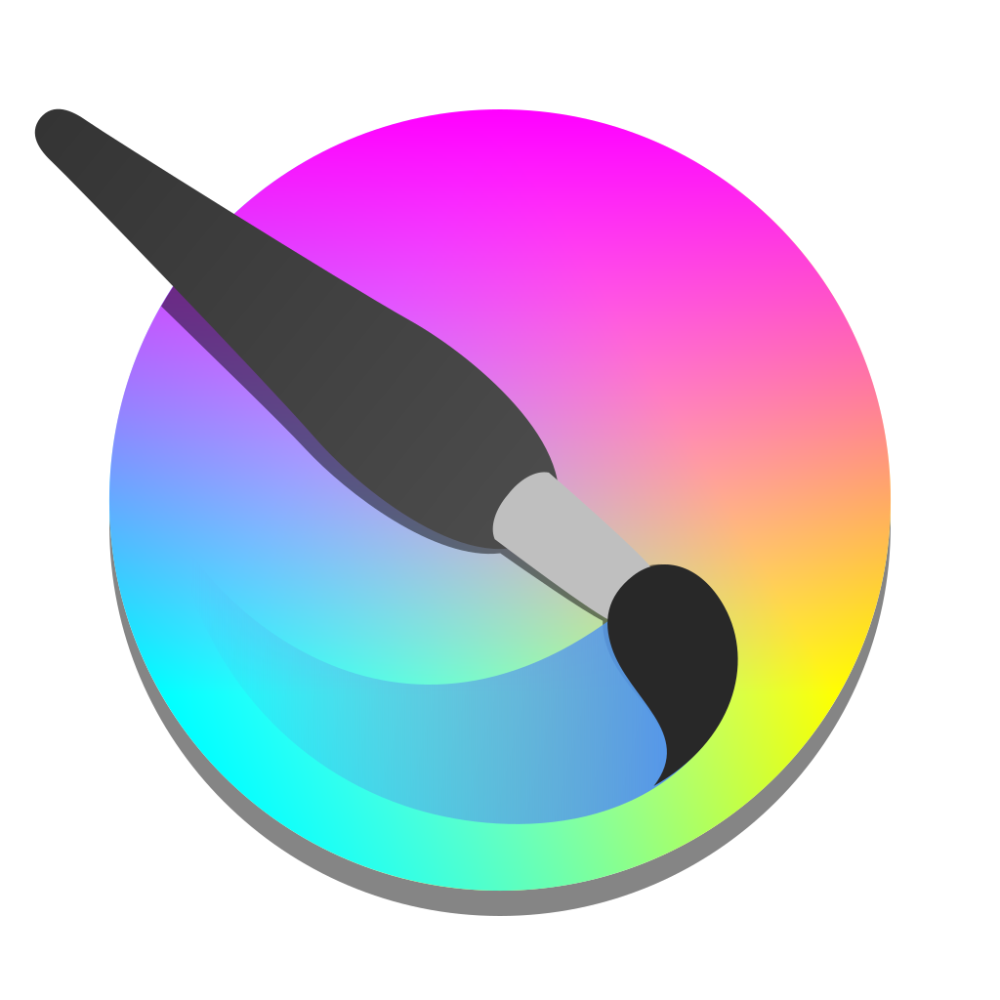

====

'''
[%collapsible]
[role="h2"]
.*🏆 GitHub Stats*
====
image::https://github-readme-stats.vercel.app/api?username=AndreAugustoDev&theme=nord&show_icons=true&hide_border=true&count_private=true[GitHub Stats, width=75%]

image::https://github-readme-stats.vercel.app/api/top-langs/?username=AndreAugustoDev&theme=nord&show_icons=true&hide_border=true&layout=compact&langs_count=8[Top Langs, width=75%]

image::https://github-profile-trophy.vercel.app/?username=andreaugustodev&theme=nord&margin-w=8&margin-h=8&no-frame=true&column=4&title=-Reviews[Trophies, width=75%]
====

'''
== *✉️ Contact*

[role="rounded-img bg-common"]
image:assets/icons/github.svg[GitHub, link="https://github.com/andreaugustodev", title="GitHub", width=48]
image:assets/icons/linkedin.svg[LinkedIn, link="https://linkedin.com/in/andreaugustoqueiroz", title="LinkedIn", width=48]

